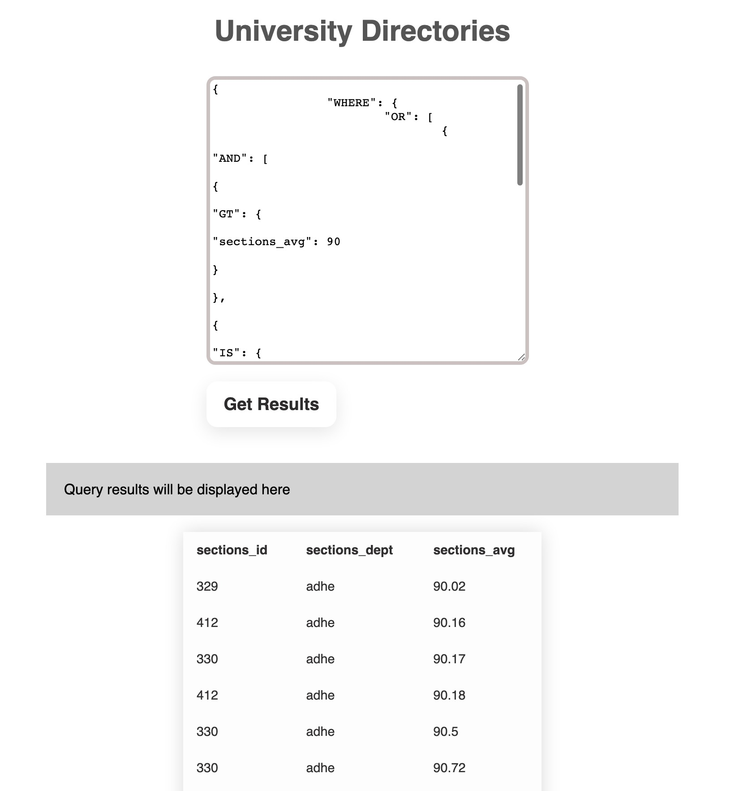
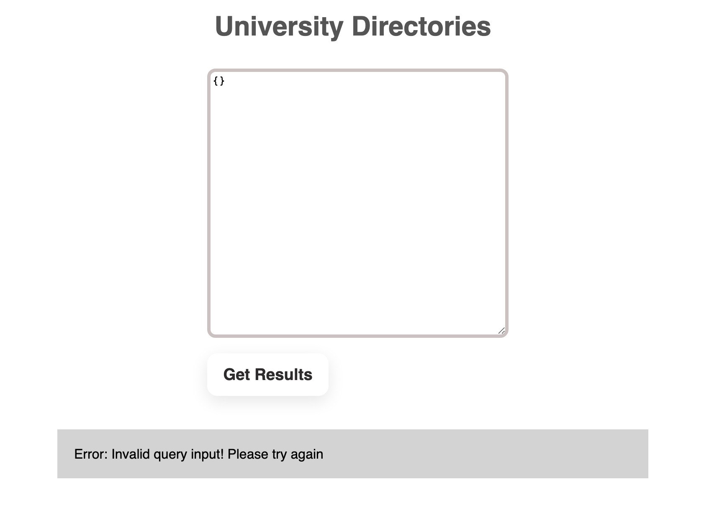

# University Directories

## Project Description

This is a full-stack web application developed by a team of two in CPSC 310 - Introduction to Software Engineering at the University of British Columbia (UBC). The application provides users with the ability to query past statistics and information on courses offered at UBC and individual classrooms.

## Features & Technologies

The application allows users to input their queries, which are retrieved by the backend through the API. The backend then completes the request by querying the appropriate data and returning the correct result.

The frontend of the application is built using simple HTML/CSS/JS, while the backend is built using Typescript and express for the API endpoints. The backend is responsible for implementing the query functionality, including search, group by, order by, and more. The information retrieved by the backend is passed to the frontend in JSON format for display.

The project was thoroughly tested using Mocha and Chai to ensure both the API endpoints and backend implementation were functioning as intended.

## Demo

When the user inputs a **valid query**, the application retrieves the relevant data and displays the results in a clean and organized table format.

When the user inputs a **invalid query**, the application shows an error message.

## Configuring environment

Follow the steps below to configure your computer to build and execute the code. The specifics of each step (especially the first two) may vary based on the operating system of your computer:

1. [Install git](https://git-scm.com/downloads) (v2.X). After installing you should be able to execute `git --version` on the command line.
2. [Install Node LTS](https://nodejs.org/en/download/), which will also install NPM (you should be able to execute `node --version` and `npm --version` on the command line).
3. [Install Yarn](https://yarnpkg.com/en/docs/install) (v1.22+). Confirm the installation by executing `yarn --version`
4. Clone this repository

## Project commands

Once the environment is configured you need to further prepare the project's tooling and dependencies.
In the project folder:

1. `yarn install` to download the packages specified in your project's *package.json* to the *node_modules* directory.
2. `yarn build` to compile your project. This command must be run after making changes to your TypeScript files.
3. `yarn test` to run the test suite.
4. `yarn pretty` to prettify your project code.

## Running and testing from an IDE

To run the project, use an IDE such as Visual Studio Code or IntelliJ IDEA and run "*yarn start*" in the Terminal. You can then access the application by navigating to "[http://localhost:4321]()" in your web browse

## Credit

This GitHub repository contains the initial codebase and instructions for a web application developed as part of the course [CPSC 310 - Introduction to Software Engineering](https://github.com/ubccpsc/310) at the University of British Columbia. Please note that all initial codebase and instructions are owned by the University of British Columbia. This repository serves as a reference for those interested in exploring the project and its development.
